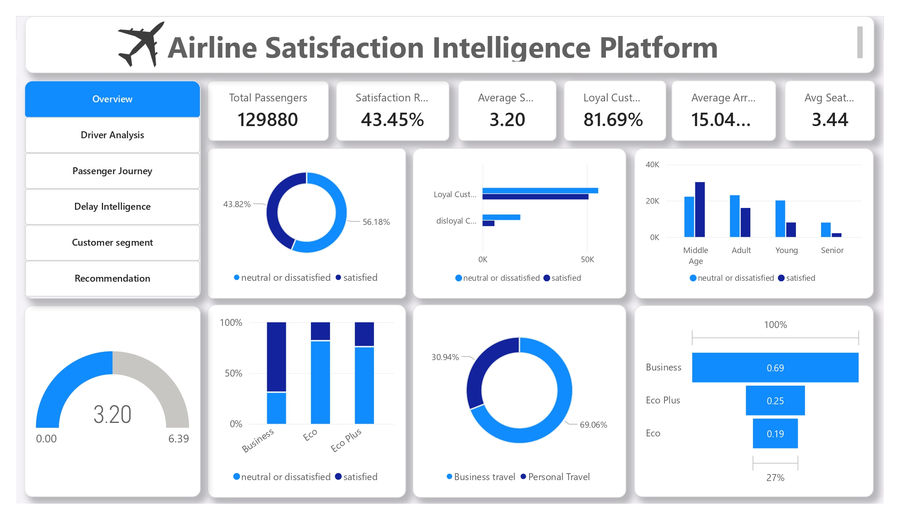
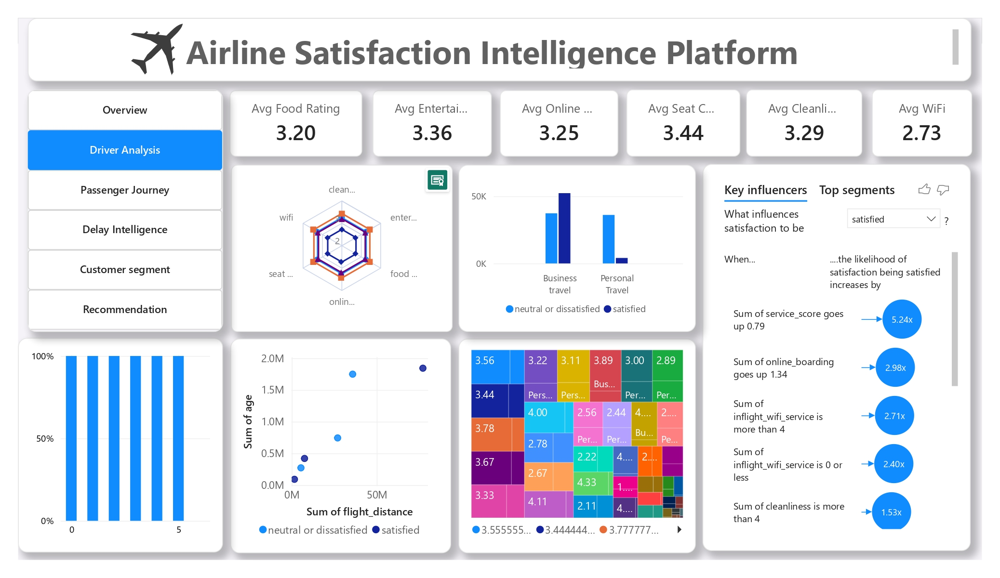
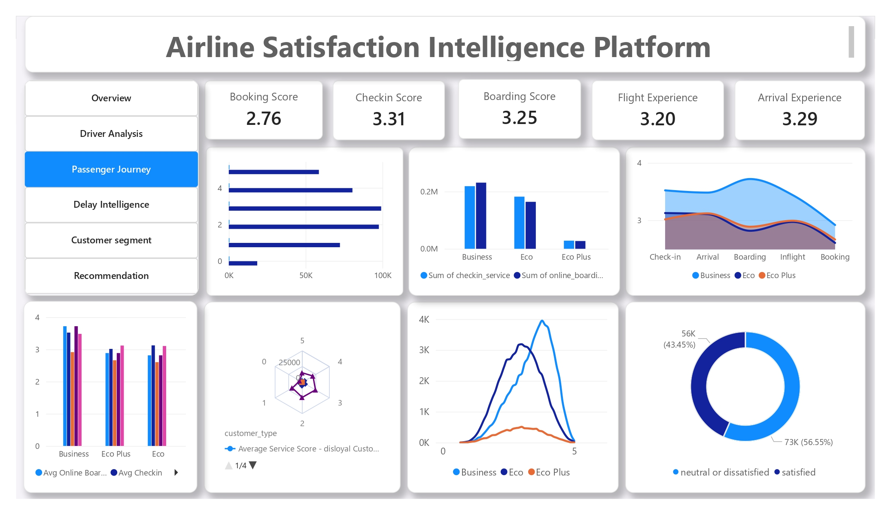
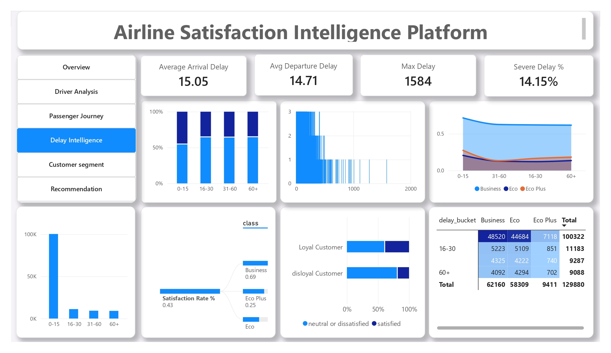
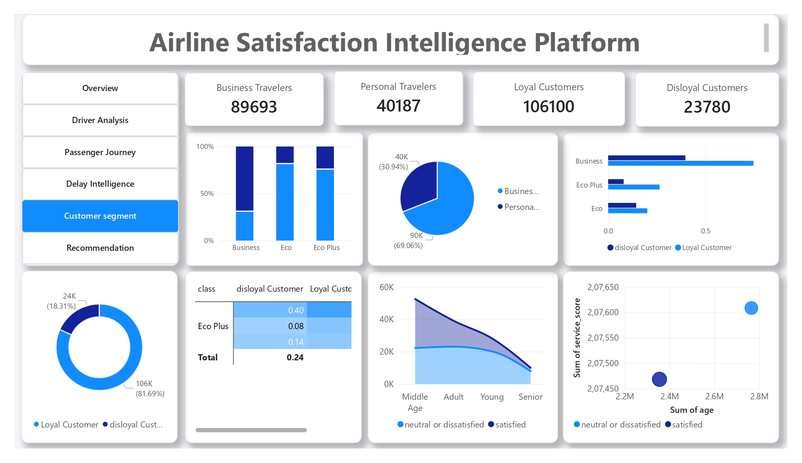
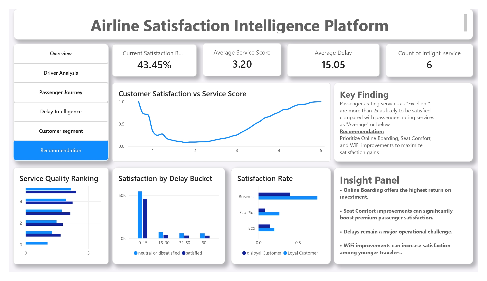

# ✈️ Airline Passenger Satisfaction Analysis

## 📌 Project Overview

This project analyzes airline passenger satisfaction data to identify the key factors influencing customer experience and satisfaction. Using Python, Excel, and Power BI, the project transforms raw airline survey data into actionable business insights through data cleaning, exploratory data analysis (EDA), KPI development, and interactive dashboards.

The objective is to help airline management understand customer behavior, service performance, delay impact, and improvement opportunities that can enhance passenger satisfaction and operational efficiency.

---

## 🎯 Business Objectives

* Identify the key drivers of passenger satisfaction.
* Analyze the impact of service quality on customer experience.
* Evaluate the effect of flight delays on satisfaction.
* Segment customers based on demographics and travel behavior.
* Provide strategic recommendations for improving airline services.

---

## 📊 Dataset Information

**Source:** Kaggle – Airline Passenger Satisfaction Dataset

**Dataset Size:**

* 129,880+ passenger records
* 20+ customer and service-related attributes

**Key Features:**

* Customer Demographics
* Travel Type
* Travel Class
* Flight Distance
* Delay Information
* Service Ratings
* Satisfaction Status

---

## 🛠️ Tools & Technologies

### Data Analysis

* Python
* Pandas
* NumPy

### Data Visualization

* Power BI
* Excel

### Development Environment

* Jupyter Notebook
* VS Code

### Version Control

* Git
* GitHub

---

## 🔄 Project Workflow

### 1. Data Collection

* Imported airline passenger satisfaction dataset.

### 2. Data Cleaning

* Removed inconsistencies and missing values.
* Standardized column names.
* Created derived features for analysis.

### 3. Feature Engineering

* Service Score Calculation
* Delay Categorization
* Age Group Segmentation

### 4. Exploratory Data Analysis (EDA)

* Customer Demographics Analysis
* Satisfaction Distribution
* Service Performance Evaluation
* Delay Impact Analysis

### 5. Dashboard Development

Created a multi-page Power BI dashboard with business-focused insights.

---

## 📈 Dashboard Pages

### 1️⃣ Executive Overview

Provides a high-level summary of passenger satisfaction, service quality, and customer distribution.

**Key Metrics**

* Satisfaction Rate
* Average Service Score
* Passenger Count
* Average Flight Distance

---

### 2️⃣ Driver Analysis

Identifies the strongest factors influencing customer satisfaction.

**Focus Areas**

* Online Boarding
* Seat Comfort
* Cleanliness
* Inflight Entertainment
* WiFi Service

---

### 3️⃣ Passenger Journey Analysis

Analyzes customer experience across different stages of the travel journey.

**Focus Areas**

* Booking Experience
* Check-In Service
* Boarding Experience
* Inflight Experience
* Arrival Experience

---

### 4️⃣ Delay Intelligence

Examines how delays affect customer satisfaction.

**Focus Areas**

* Delay Distribution
* Delay Categories
* Satisfaction by Delay Bucket
* Delay Impact Across Classes

---

### 5️⃣ Customer Segmentation

Segments customers by demographics and travel behavior.

**Segments**

* Loyal vs Disloyal Customers
* Business vs Personal Travelers
* Travel Class
* Age Groups

---

### 6️⃣ Strategy & Recommendations

Provides actionable recommendations based on analytical findings.

**Recommendations**

* Improve Online Boarding Process
* Enhance Seat Comfort
* Reduce Flight Delays
* Upgrade Inflight WiFi Services
* Improve Economy Class Experience

---

## 📷 Dashboard Screenshots

### Executive Overview



### Driver Analysis



### Passenger Journey Analysis



### Delay Intelligence



### Customer Segmentation



### Strategy & Recommendations



---

## 🔍 Key Insights

* Online Boarding is one of the strongest drivers of passenger satisfaction.
* Business Class passengers consistently report higher satisfaction levels.
* Satisfaction decreases significantly as delays increase.
* Inflight WiFi receives relatively lower ratings compared to other services.
* Loyal customers demonstrate higher satisfaction than disloyal customers.
* Seat Comfort and Inflight Entertainment have a strong impact on customer experience.

---

## 💡 Business Recommendations

### High Priority

* Improve Online Boarding Experience
* Enhance Seat Comfort
* Reduce Operational Delays

### Medium Priority

* Upgrade Inflight WiFi Quality
* Improve Food & Beverage Services

### Strategic Focus

* Enhance Economy Class Experience
* Strengthen Customer Loyalty Programs
* Improve Digital Customer Touchpoints

---

## 📂 Repository Structure

```text
Airline-Passenger-Satisfaction-Analysis/
│
├── data/
│   ├── raw data/
│   └── processed/
│
├── notebook/
│   └── eda.ipynb
│
├── scripts/
│   ├── data_cleaning.py
│   └── data_cleaning.ipynb
│
├── powerbi/
│   └── Airline.pbix
│
├── images/
│
├── output/
│   └── reports/
│
├── requirements.txt
│
└── README.md
```

---

## 👨‍💻 Author

**Adarsh Singh**

Aspiring Data Analyst | Power BI Developer | Python Enthusiast

### Skills Demonstrated

* Data Cleaning
* Data Analysis
* Exploratory Data Analysis (EDA)
* Data Visualization
* Dashboard Development
* Business Intelligence
* Data Storytelling
* Business Recommendations

---

⭐ If you found this project useful, consider giving the repository a star.
